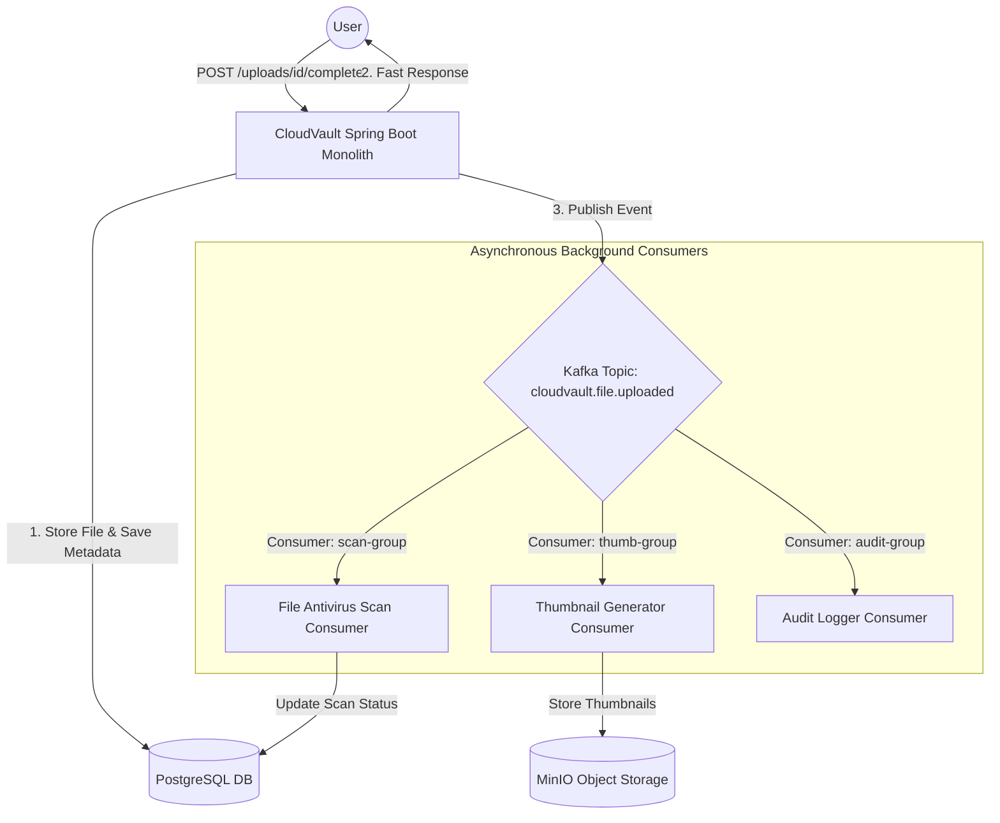

# Apache Kafka for Background Tasks in CloudVault Monolith

This guide details how **Apache Kafka** is integrated directly into the CloudVault Spring Boot monolith to execute asynchronous, non-blocking background workflows (antivirus scanning, thumbnail generation, audit logging, and automated cleanup).

---

## 📌 Architectural Overview

Instead of executing heavy processing synchronously during HTTP upload requests, the API controller immediately returns a successful response to the user while publishing an event to **Apache Kafka**. Background consumers process the tasks asynchronously:



---

## 💡 Why Kafka for Monolith Background Tasks?

- **Non-Blocking User Experience**: File uploads finish instantly without waiting for antivirus scanning or thumbnail generation.
- **Fault Tolerance & Retries**: If thumbnail generation or antivirus scanning fails, Kafka automatically retries without losing messages.
- **Scalability**: Background workers run concurrently across thread pools or separate background consumer instances.

---

## 🛠️ Step-by-Step Implementation Guide

### Step 1: Run Kafka via Docker Compose

Add Kafka to your local development setup (`docker-compose.yml`):

```yaml
version: '3.8'
services:
  zookeeper:
    image: confluentinc/cp-zookeeper:7.5.0
    container_name: cloudvault-zookeeper
    ports:
      - "2181:2181"
    environment:
      ZOOKEEPER_CLIENT_PORT: 2181

  kafka:
    image: confluentinc/cp-kafka:7.5.0
    container_name: cloudvault-kafka
    depends_on:
      - zookeeper
    ports:
      - "9092:9092"
    environment:
      KAFKA_BROKER_ID: 1
      KAFKA_ZOOKEEPER_CONNECT: zookeeper:2181
      KAFKA_ADVERTISED_LISTENERS: PLAINTEXT://localhost:9092
      KAFKA_OFFSETS_TOPIC_REPLICATION_FACTOR: 1
```

Run Kafka:
```bash
docker-compose up -d kafka
```

---

### Step 2: Add `spring-kafka` Dependency

In `Backend/pom.xml`:

```xml
<dependency>
    <groupId>org.springframework.kafka</groupId>
    <artifactId>spring-kafka</artifactId>
</dependency>
```

---

### Step 3: Application Configuration

In `Backend/src/main/resources/application.properties`:

```properties
# ── Apache Kafka ─────────────────────────────────────────────────────────────
spring.kafka.bootstrap-servers=localhost:9092

# Producer Config
spring.kafka.producer.key-serializer=org.apache.kafka.common.serialization.StringSerializer
spring.kafka.producer.value-serializer=org.springframework.kafka.support.serializer.JsonSerializer

# Consumer Config
spring.kafka.consumer.auto-offset-reset=earliest
spring.kafka.consumer.key-deserializer=org.apache.kafka.common.serialization.StringDeserializer
spring.kafka.consumer.value-deserializer=org.springframework.kafka.support.serializer.JsonDeserializer
spring.kafka.consumer.properties.spring.json.trusted.packages=com.CloudVault.Backend.*
```

---

### Step 4: Event DTO Definition (`FileUploadedEvent`)

Create `com.CloudVault.Backend.file.event.FileUploadedEvent`:

```java
package com.CloudVault.Backend.file.event;

import java.time.Instant;
import java.util.UUID;

public record FileUploadedEvent(
        UUID fileId,
        String fileName,
        String objectKey,
        long size,
        String contentType,
        UUID ownerId,
        Instant uploadedAt
) {}
```

---

### Step 5: Event Producer (`FileEventPublisher`)

Create `com.CloudVault.Backend.file.event.FileEventPublisher`:

```java
package com.CloudVault.Backend.file.event;

import com.CloudVault.Backend.file.entity.FileMetadata;
import lombok.RequiredArgsConstructor;
import lombok.extern.slf4j.Slf4j;
import org.springframework.kafka.core.KafkaTemplate;
import org.springframework.stereotype.Component;

import java.time.Instant;

@Slf4j
@Component
@RequiredArgsConstructor
public class FileEventPublisher {

    private static final String TOPIC_FILE_UPLOADED = "cloudvault.file.uploaded";
    private final KafkaTemplate<String, FileUploadedEvent> kafkaTemplate;

    public void publishFileUploaded(FileMetadata file) {
        FileUploadedEvent event = new FileUploadedEvent(
                file.getId(),
                file.getOriginalFileName(),
                file.getObjectKey(),
                file.getSize(),
                file.getContentType(),
                file.getOwner().getId(),
                Instant.now()
        );

        kafkaTemplate.send(TOPIC_FILE_UPLOADED, file.getId().toString(), event)
                .whenComplete((result, ex) -> {
                    if (ex == null) {
                        log.info("Published FileUploadedEvent for fileId: {}", file.getId());
                    } else {
                        log.error("Failed to publish FileUploadedEvent for fileId: {}", file.getId(), ex);
                    }
                });
    }
}
```

Trigger publishing in `UploadService.completeUpload(...)`:
```java
fileEventPublisher.publishFileUploaded(savedFile);
```

---

### Step 6: Asynchronous Background Consumers

#### 1. File Antivirus Scan Consumer (`FileScanConsumer.java`)
```java
package com.CloudVault.Backend.file.consumer;

import com.CloudVault.Backend.file.event.FileUploadedEvent;
import lombok.extern.slf4j.Slf4j;
import org.springframework.kafka.annotation.KafkaListener;
import org.springframework.kafka.annotation.RetryableTopic;
import org.springframework.retry.annotation.Backoff;
import org.springframework.stereotype.Component;

@Slf4j
@Component
public class FileScanConsumer {

    @RetryableTopic(attempts = "3", backoff = @Backoff(delay = 1000, multiplier = 2.0))
    @KafkaListener(topics = "cloudvault.file.uploaded", groupId = "scan-group")
    public void scanFile(FileUploadedEvent event) {
        log.info("Starting background antivirus scan for fileId={}, name={}", event.fileId(), event.fileName());
        
        // Asynchronous scanning logic...
        
        log.info("File scan clean for fileId={}", event.fileId());
    }
}
```

#### 2. Thumbnail Generator Consumer (`ThumbnailConsumer.java`)
```java
package com.CloudVault.Backend.file.consumer;

import com.CloudVault.Backend.file.event.FileUploadedEvent;
import lombok.extern.slf4j.Slf4j;
import org.springframework.kafka.annotation.KafkaListener;
import org.springframework.stereotype.Component;

@Slf4j
@Component
public class ThumbnailConsumer {

    @KafkaListener(topics = "cloudvault.file.uploaded", groupId = "thumbnail-group")
    public void generateThumbnail(FileUploadedEvent event) {
        if (event.contentType() != null && event.contentType().startsWith("image/")) {
            log.info("Generating thumbnail image preview for fileId={}", event.fileId());
            // Thumbnail rendering logic...
        }
    }
}
```

---

## 🧪 Verification & Testing Plan

1. Start Kafka container: `docker-compose up -d kafka`.
2. Start CloudVault backend monolith (`./mvnw spring-boot:run`).
3. Complete a file upload.
4. Check backend application logs to observe immediate HTTP completion followed by background processing from `FileScanConsumer` and `ThumbnailConsumer`.
